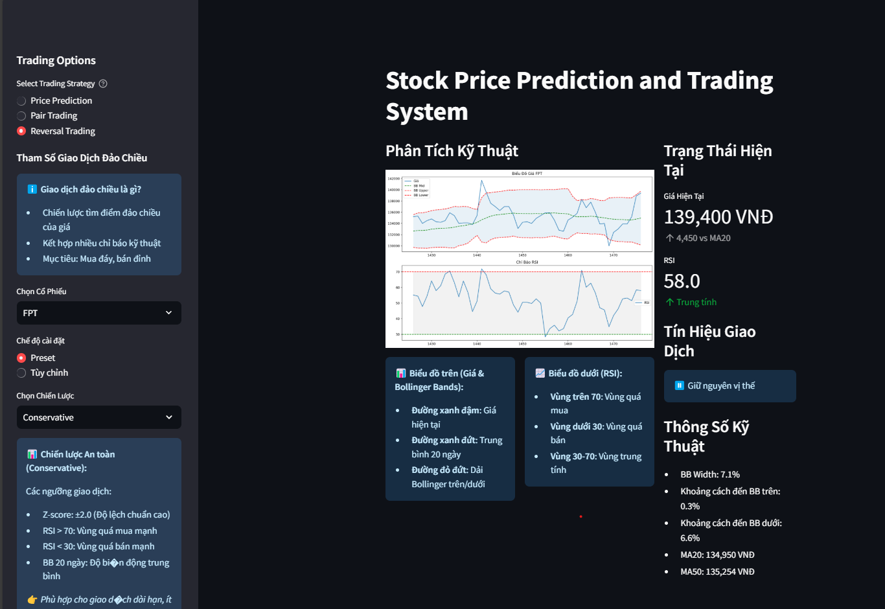

# MiniProj_StockPrediction_SupportDATN2024
Work on a friend's graduation project together

Link facebook của bạn: https://www.facebook.com/profile.php?id=100011544648795


# 1. DATASET + CRAWL + EDA

## 1.1 Top 10 company và các cặp PAIR TRADING, TRADING REVERSAL

1. FPT Corporation (FPT)
- Công ty CNTT lớn nhất Việt Nam
- Hoạt động đa dạng: phần mềm, viễn thông, giáo dục
- Doanh thu chủ yếu từ xuất khẩu phần mềm và dịch vụ CNTT

2. CMC Corporation (CMG)
- Tập đoàn công nghệ lớn thứ 2 Việt Nam
- Tập trung vào: tích hợp hệ thống, phần mềm, hạ tầng số
- Đối thủ trực tiếp với FPT
→ Cặp pair trading tiềm năng: FPT-CMG (do cùng mô hình kinh doanh và quy mô)

3. CMT Group (CMT)
- Chuyên về thiết bị công nghệ và viễn thông
- Phân phối thiết bị CNTT và giải pháp mạng
- Có quan hệ với Viettel

4. DigiWorld (DGW)
- Phân phối sản phẩm CNTT và điện tử tiêu dùng
- Đối tác của các thương hiệu lớn như Apple, Xiaomi
→ Cặp pair trading tiềm năng: CMT-DGW (cùng lĩnh vực phân phối thiết bị)

5. ELCOM Corporation (ELC)
- Chuyên về tự động hóa và điện tử công nghiệp
- Cung cấp giải pháp cho ngành điện và công nghiệp

6. SAM Holdings (SAM)
- Sản xuất cáp và vật liệu viễn thông
- Đầu tư vào bất động sản và năng lượng
→ Cặp pair trading tiềm năng: ELC-SAM (liên quan đến phần cứng và hạ tầng)

7. VGC Technology (VGC)
- Giải pháp phần mềm cho doanh nghiệp
- Tích hợp hệ thống và tư vấn CNTT

8. Vietnam Investment Group (VGI)
- Đầu tư vào công nghệ và chuyển đổi số
- Phát triển phần mềm và giải pháp số
→ Cặp pair trading tiềm năng: VGC-VGI (cùng tập trung vào giải pháp phần mềm)

9. Viettel Post (VTP)
- Logistics và thương mại điện tử
- Ứng dụng công nghệ trong vận chuyển và logistics

10. VTL Technology (VTL)
- Phát triển phần mềm và giải pháp công nghệ
- Dịch vụ tư vấn CNTT
→ Cặp pair trading tiềm năng: VTP-VTL (ứng dụng công nghệ trong logistics)


## 1.2. **Crawl Data:**
- Sử dụng `vnstock3` để crawl data với những dòng code đơn giản, link tham khảo: https://colab.research.google.com/github/thinh-vu/vnstock/blob/main/docs/1_vietnam_stock_vnstock3.ipynb?fbclid=IwY2xjawG1nDNleHRuA2FlbQIxMAABHb9dHH5bKxdzzO_F6VMZaoSHOebVUxKpOiaSQ0XKAQRoLx0pY6KTzpgQFg_aem_f2hSoof4p8kCgilg45Lq-g#scrollTo=PN2OpRhSrNai
- Link: https://vnstocks.com/docs/tai-lieu/migration-chuyen-doi-sang-vnstock3/
- Link: https://github.com/thinh-vu/vnstock
- Thời gian crawl data: 1 version từ 2023-2024 và 1 version từ 2019-2024

## 1.3 EDA:
- Xem chi tiết ở: `code_notebooks_CrawlData_andPreProcessing`
    - Xem tổng quan ở: `code_notebooks_CrawlData_andPreProcessing\0_EDA[SUMMARY]_Correlation10ChiSoCK.ipynb`
    - Xem chi tiết ở thư mục: `code_notebooks_CrawlData_andPreProcessing\detail_EDA`

### **1.3.1 Tóm tắt các mức tương quan cao nhất và thấp nhất**

| **Cặp cổ phiếu**         | **Tương quan** | **Nhận xét** |
|--------------------------|-----------------|---------------|
| **CMG - VGI**            | **0.957**       | Mức tương quan rất cao, cho thấy hai cổ phiếu **thường di chuyển cùng chiều**. Đây có thể là cặp tiềm năng cho **pair trading**. |
| **ELC - VTP**            | **0.952**       | Tương quan mạnh, cho thấy hai cổ phiếu có xu hướng **cùng biến động**, thích hợp cho chiến lược pair trading. |
| **FPT - CMG**            | **0.930**       | Hai cổ phiếu công nghệ lớn, thường **tăng/giảm cùng nhau**. Cặp này có thể tận dụng cho giao dịch cặp với độ an toàn cao. |
| **VGI - VTL**            | **-0.925**      | Mức tương quan âm rất mạnh. Khi VGI tăng thì VTL giảm và ngược lại. Đây là cặp **tiềm năng cho chiến lược trading ngược chiều**. |
| **VTL - FPT**            | **-0.793**      | Mức tương quan âm khá cao. Có thể khai thác chiến lược dựa trên sự **phân kỳ** giữa hai cổ phiếu này. |

---

### **1.3.2. Phân tích chi tiết theo nhóm cổ phiếu**

#### **Nhóm cổ phiếu có tương quan cao (Cùng chiều)**

- **FPT - CMG (0.930)**: 
  - Đây là hai công ty lớn trong ngành công nghệ Việt Nam. Mức tương quan cao cho thấy cả hai thường bị ảnh hưởng bởi các yếu tố thị trường chung.
  - **Chiến lược**: **Pair trading**, tận dụng chênh lệch giá khi có sự khác biệt lớn trong biến động của hai cổ phiếu.

- **ELC - VTP (0.952)**:
  - Cả hai cổ phiếu đều liên quan đến hạ tầng và công nghệ. Khi một trong hai cổ phiếu thay đổi, cổ phiếu còn lại có xu hướng thay đổi tương tự.
  - **Chiến lược**: Pair trading với tỷ lệ hedge thấp, vì tương quan gần như tuyệt đối.

- **CMG - VGI (0.957)**:
  - Tương quan mạnh mẽ giữa hai công ty công nghệ. Khi giá của một cổ phiếu tăng hoặc giảm, cổ phiếu kia có xu hướng biến động tương tự.
  - **Chiến lược**: Pair trading để tận dụng sự khác biệt về tốc độ phản ứng giá.

#### **Nhóm cổ phiếu có tương quan âm (Ngược chiều)**

- **VGI - VTL (-0.925)**:
  - Tương quan âm rất mạnh cho thấy **khi VGI tăng giá, VTL có xu hướng giảm giá** và ngược lại.
  - **Chiến lược**: Giao dịch ngược chiều (reversal trading). Mua một cổ phiếu và bán cổ phiếu kia khi có tín hiệu phân kỳ.

- **FPT - VTL (-0.793)**:
  - Khi FPT tăng thì VTL giảm, và ngược lại. Có thể khai thác sự khác biệt này cho chiến lược giao dịch.
  - **Chiến lược**: Tận dụng sự phân kỳ để tìm cơ hội kiếm lợi nhuận từ chênh lệch giá.

---

### **1.3.3. Đề xuất chiến lược giao dịch dựa trên kết quả phân tích**

| **Cặp cổ phiếu** | **Chiến lược đề xuất** | **Giải thích** |
|------------------|-----------------------|----------------|
| **CMG - VGI**    | Pair Trading         | Tận dụng tương quan rất cao (0.957) để mua/bán dựa trên chênh lệch giá. |
| **ELC - VTP**    | Pair Trading         | Mức tương quan gần như tuyệt đối (0.952), phù hợp cho chiến lược giao dịch cặp an toàn. |
| **VGI - VTL**    | Trading Reversal     | Tương quan âm mạnh (-0.925), tận dụng biến động ngược chiều. |
| **FPT - CMG**    | Pair Trading         | Tương quan cao (0.930), giúp tối ưu hóa chiến lược giao dịch cặp. |
| **FPT - VTL**    | Trading Reversal     | Tương quan âm (-0.793), có thể khai thác sự phân kỳ cho giao dịch đảo chiều. |

---

### **1.34. Kết luận**
- **Cổ phiếu cùng chiều**: Tận dụng chiến lược pair trading cho các cặp có tương quan cao để giảm thiểu rủi ro.
- **Cổ phiếu ngược chiều**: Khai thác sự phân kỳ cho chiến lược giao dịch đảo chiều, giúp tối ưu hóa lợi nhuận khi thị trường biến động.

------------------------------------

# 2. TRAINING MODEL 

## 2.1. **WORK WITH TIME-SERIES DATA:**

Data preprocessing methodology:

- When working with time-series data such as Bitcoin prediction problem, it is recommended to set `shuffle=False` when splitting data into train-test. (This is because if `shuffle=True`, we may end up predicting past Bitcoin prices). <br>
For other prediction problems such as house prices or car prices, it is appropriate to set `shuffle=True` (because if `shuffle=False`, for example, the house price data is sorted by price, then there is a risk of falling into the case where all houses put into the test set have higher/lower values than the average and this will result in a poor model).

- This data is time series it's sequential, so we don't use Cross-Validation or any of the model ML techniques to evaluate error. TimeSeriesSplit, which is a specific type of cross-validation technique used for time series data. It's important to use time-series cross-validation when dealing with sequential data to avoid training on future data. TimeSeriesSplit splits the data into folds, so that the folds with data from the previous past will be used as the training set, and the future data will only be used as the test set. For example, if we split the data into 3 folds, each fold would consist of:
    - Fold 1: Data from January 2016 to December 2017 (training set) and data from January 2018 to December 2018 (test set).    
    - Fold 2: Data from January 2016 to December 2018 (training set) and data from January 2019 to December 2019 (test set).    
    - Fold 3: Data from January 2016 to December 2019 (training set) and data from January 2020 to December 2020 (test set). <br>

The code: `tscv = TimeSeriesSplit(n_splits=3)` will creat a time-series cross-validation object that splits the data into 3 folds in chronological order.

- It's convenient: to have data ORDERED IN INCREASING ORDER OF DATE(with Time-Series Data)


## 2.2 Model Training:

1. **Multi Linear Regression:**
- Training full các file Dataset trên RIDGE Linear Regression model: file `manyDataset_RIDGELinearRegModel.ipynb`

2. **LSTM:**
- Training full các file Dataset trên LSTM model: file `manyDataset_LSTM_Model.ipynb`

3. **ARIMA:**
- Training full các file Dataset trên ARIMA model: file `manyDataset_ARIMA_Model.ipynb`

Xem kỹ: `2_code_notebooks_TrainingModel\utils\note2_TrainingModel.md` để hiểu hơn về các model hoạt động?

--------

## 2.3 Kết quả dự đoán giá cổ phiếu của các model: 
- Linear Regression đang cho thấy kết quả tốt hơn các model: LSTM và ARIMA. Kết quả xem tại: `2_code_notebooks_TrainingModel\results` với từng loại trong 10 cổ phiếu. 
- Các kết quả giữa GIÁ THỰC TẾ và GIÁ DỰ ĐOÁN xem tại: `2_code_notebooks_TrainingModel\compare_RealVsPredict`
và `2_code_notebooks_TrainingModel\compare_RealVsPredict\code_read_compare_RealVSPrdiction.ipynb`

```
Dự đoán giá cổ phiếu của 10 cái chứng khoán đó bằng ít nhất 3 loại mô hình ( lstm model, arima, liner, Prophet) rồi dựa vào cái chỉ số  RMSE, MAE, MSE để kiếm tra cái mô hình tốt nhất cho 10 cái cổ phiếu đó

Và cái 1 bảng so sánh kết quả giữa dự đoán với thực tế của mỗi data tại: `2_code_notebooks_TrainingModel\compare_RealVsPredict\code_read_compare_RealVSPrdiction.ipynb`
```

### Đánh giá tổng quan về hiệu suất của các mô hình dự đoán giá cổ phiếu dựa trên các file kết quả trong thư mục `2_code_notebooks_TrainingModel\results`:

#### **1. Tổng quan về các mô hình**
- **Mô hình Ridge Regression**:
  - Là một trong những mô hình phổ biến cho hồi quy tuyến tính, Ridge Regression đã cho thấy hiệu suất tốt trên nhiều bộ dữ liệu.
  - Mô hình này có khả năng xử lý tốt các vấn đề đa cộng tuyến và thường cho kết quả ổn định hơn so với hồi quy tuyến tính thông thường.

- **Mô hình LSTM**:
  - LSTM (Long Short-Term Memory) là một loại mạng nơ-ron hồi tiếp, rất hiệu quả trong việc xử lý dữ liệu chuỗi thời gian.
  - Mô hình này có khả năng ghi nhớ thông tin lâu dài, giúp cải thiện độ chính xác trong dự đoán giá cổ phiếu.

- **Mô hình ARIMA**:
  - ARIMA (AutoRegressive Integrated Moving Average) là một mô hình thống kê truyền thống cho chuỗi thời gian.
  - Mặc dù ARIMA có thể hoạt động tốt với dữ liệu có tính chất chuỗi thời gian, nhưng nó có thể gặp khó khăn với dữ liệu không ổn định hoặc có nhiều biến động.

#### **2. Hiệu suất của các mô hình**
- **Ridge Regression**:
  - Hiệu suất tốt trên bộ dữ liệu CMT và SAM với R2 cao (trên 0.98), nhưng gặp khó khăn với dữ liệu DGW và CMT trong tập kiểm tra, cho thấy dấu hiệu của overfitting.
  - MAPE cho thấy độ chính xác tuyệt đối của mô hình cần cải thiện, đặc biệt là trên dữ liệu chưa thấy.

- **LSTM**:
  - Mô hình LSTM cho thấy khả năng dự đoán tốt với R2 cao (0.9936 cho FPT), nhưng MAPE cao cho thấy độ chính xác tuyệt đối vẫn cần cải thiện.
  - LSTM có thể là lựa chọn tốt cho các dữ liệu có tính chất chuỗi thời gian phức tạp.

- **ARIMA**:
  - Mô hình ARIMA cho thấy hiệu suất kém trong một số bộ dữ liệu, đặc biệt là với R2 âm trong tập kiểm tra, cho thấy mô hình không hoạt động tốt với dữ liệu chưa thấy.

#### **3. Kết luận**
- **Tổng quan**: Ridge Regression và LSTM là hai mô hình chính cho dự đoán giá cổ phiếu, với Ridge Regression cho kết quả ổn định hơn trong một số trường hợp, trong khi LSTM có khả năng xử lý tốt hơn với dữ liệu chuỗi thời gian phức tạp.
- **Khuyến nghị**: Cần thực hiện thêm các bước như điều chỉnh tham số, thử nghiệm với các mô hình khác, và cải thiện độ chính xác tuyệt đối của các mô hình để đạt được kết quả tốt hơn trong dự đoán giá cổ phiếu.
- **Hướng phát triển**: Nên xem xét việc kết hợp các mô hình (ensemble methods) hoặc sử dụng các kỹ thuật học sâu khác để cải thiện hiệu suất dự đoán.

-----------------------------------------------------

Dựa trên các dữ liệu đã tải lên, bảng chi tiết đánh giá theo từng cổ phiếu đã được hoàn thiện dưới đây:
Dưới đây là bảng được cập nhật với **nhận xét chi tiết** dựa trên các chỉ số:

---

| **Cổ phiếu** | **Mô hình** | **Train R²** | **Test R²** | **Train MAPE%** | **Test MAPE%** | **Nhận xét**                                                                                                   |
|--------------|-------------|--------------|-------------|-----------------|----------------|---------------------------------------------------------------------------------------------------------------|
| **ELC**      | Ridge       | 0.9938       | 0.9838      | 2.78%          | 2.39%          | Mô hình có độ chính xác cao (R² cao) và sai số thấp (MAPE thấp) trên cả tập huấn luyện và kiểm tra, cho thấy sự ổn định vượt trội. |
|              | LSTM        | 0.9861       | 0.9427      | 4.32%          | 4.37%          | Mô hình có khả năng dự đoán tốt (R² khá cao) nhưng MAPE cao hơn Ridge, phản ánh mức độ nhạy cảm với dữ liệu biến động.            |
|              | ARIMA       | 0.9956       | -5.0019     | 2.14%          | 50.55%         | Mặc dù R² huấn luyện cao, giá trị R² kiểm tra âm và MAPE kiểm tra cao cho thấy mô hình không phù hợp với dữ liệu biến động.       |
| **FPT**      | Ridge       | 0.9972       | 0.9935      | 1.51%          | 1.45%          | R² rất cao và MAPE thấp trên cả hai tập dữ liệu, chứng minh mô hình dự đoán chính xác và phù hợp với dữ liệu.                      |
|              | LSTM        | 0.9941       | 0.6955      | 2.32%          | 8.89%          | R² thấp trên tập kiểm tra và MAPE tăng cao phản ánh rằng mô hình không xử lý tốt các biến động bất thường trong dữ liệu.          |
|              | ARIMA       | 0.9974       | -2.3555     | 1.28%          | 34.35%         | Hiệu quả trên tập huấn luyện (R² cao, MAPE thấp), nhưng thất bại trên tập kiểm tra (R² âm và MAPE cao), không đáng tin cậy.      |
| **SAM**      | Ridge       | 0.9872       | 0.8737      | 2.29%          | 1.84%          | R² thấp hơn trên tập kiểm tra so với tập huấn luyện, cho thấy khả năng overfitting; tuy nhiên, MAPE thấp đảm bảo độ chính xác.   |
|              | LSTM        | 0.9651       | 0.1735      | 4.68%          | 5.20%          | R² kiểm tra rất thấp và MAPE cao, mô hình không phù hợp với dữ liệu này.                                       |
|              | ARIMA       | 0.9908       | -0.8468     | 1.86%          | 9.00%          | R² âm trên tập kiểm tra và MAPE cao phản ánh rằng mô hình thất bại trong việc dự đoán với dữ liệu biến động.                     |
| **VGC**      | Ridge       | 0.9903       | 0.9396      | 2.51%          | 1.90%          | R² và MAPE ổn định trên cả hai tập, cho thấy mô hình phù hợp với dữ liệu này.                                                     |
|              | LSTM        | 0.9832       | 0.8938      | 3.65%          | 2.61%          | R² thấp hơn Ridge và MAPE cao hơn, nhưng vẫn chấp nhận được; mô hình phù hợp hơn với dữ liệu có ít nhiễu.                       |
|              | ARIMA       | 0.9929       | -1.2397     | 2.06%          | 11.98%         | R² âm và MAPE cao trên tập kiểm tra, không thích hợp với dữ liệu có biến động mạnh.                                              |
| **VTP**      | Ridge       | 0.9885       | 0.9861      | 1.89%          | 2.34%          | R² và MAPE rất ổn định, cho thấy mô hình hoạt động tốt trên cả hai tập dữ liệu.                                                   |
|              | LSTM        | 0.9659       | 0.8789      | 3.47%          | 9.12%          | R² kiểm tra thấp và MAPE cao cho thấy mô hình nhạy cảm với dữ liệu biến động, giảm hiệu quả dự đoán.                             |
|              | ARIMA       | 0.9832       | -2.1530     | 1.56%          | 41.80%         | Hiệu quả thấp (R² âm, MAPE cao) trên tập kiểm tra, chỉ phù hợp với dữ liệu ổn định.                                              |
| **VTL**      | Ridge       | 0.9888       | 0.9815      | 1.77%          | 2.98%          | Mô hình hoạt động ổn định với độ chính xác cao (R² cao và MAPE thấp) trên cả hai tập dữ liệu.                                     |
|              | LSTM        | 0.9735       | 0.9221      | 3.43%          | 8.23%          | Mặc dù R² kiểm tra thấp hơn Ridge, nhưng mô hình vẫn hoạt động khá tốt; MAPE kiểm tra cao hơn cho thấy độ chính xác giảm nhẹ.    |
|              | ARIMA       | 0.9701       | -0.4304     | 1.62%          | 46.30%         | Hiệu suất không ổn định, MAPE rất cao trên tập kiểm tra, không phù hợp với dữ liệu có biến động.                                 |
| **DGW**      | Ridge       | 0.9950       | 0.9338      | 3.14%          | 2.02%          | Mô hình hoạt động ổn định, R² và MAPE ở mức tốt trên cả hai tập dữ liệu.                                                         |
|              | LSTM        | 0.9892       | 0.8498      | 4.53%          | 3.18%          | Hiệu suất giảm trên tập kiểm tra, độ chính xác không bằng Ridge; nhạy cảm với dữ liệu biến động.                                 |
|              | ARIMA       | 0.9969       | -9.1079     | 2.40%          | 32.16%         | R² âm và MAPE cao trên tập kiểm tra, mô hình không phù hợp với dữ liệu này.                                                      |
| **CMG**      | Ridge       | 0.9914       | 0.9773      | 2.16%          | 1.94%          | Hiệu suất tốt và ổn định trên cả hai tập dữ liệu; R² cao và MAPE thấp phản ánh độ chính xác cao.                                |
|              | LSTM        | 0.9816       | 0.7669      | 3.37%          | 6.09%          | Mô hình giảm hiệu suất trên tập kiểm tra; độ nhạy cao với dữ liệu biến động.                                                     |
|              | ARIMA       | 0.9924       | -1.1589     | 1.80%          | 19.40%         | Mô hình thất bại trên tập kiểm tra, chỉ phù hợp với dữ liệu ổn định.                                                             |
| **CMT**      | Ridge       | 0.9865       | 0.9548      | 3.29%          | 3.16%          | Mô hình hoạt động ổn định và phù hợp với dữ liệu, MAPE ở mức chấp nhận được.                                                     |
|              | LSTM        | 0.9693       | 0.8596      | 5.72%          | 6.69%          | R² thấp và MAPE cao hơn Ridge trên cả hai tập, hiệu suất không bằng Ridge.                                                       |
|              | ARIMA       | 0.9881       | -0.9829     | 3.10%          | 22.82%         | R² âm và MAPE cao trên tập kiểm tra, không hiệu quả với dữ liệu biến động.                                                       |

--- 

### Giải thích:  
- **Nhận xét chi tiết** được dựa trên sự kết hợp giữa:
  - **R²**: Đánh giá mức độ mô hình giải thích sự biến động của dữ liệu (giá trị cao là tốt).  
  - **MAPE**: Đánh giá độ chính xác của dự đoán dưới dạng phần trăm (giá trị thấp là tốt).  
- Các nhận xét phản ánh tính phù hợp của từng mô hình với dữ liệu cụ thể, đặc biệt khi so sánh giữa tập huấn luyện và kiểm tra.

Nhận xét chi tiết về các mô hình trong bảng dựa vào dữ liệu:
1. Ridge Regression: Mô hình tốt nhất tổng quan
Dựa vào dữ liệu:

R² cao và ổn định: Ridge đạt R² cao trên cả tập huấn luyện và kiểm tra. Ví dụ:
Với cổ phiếu FPT: Train R² = 0.9972, Test R² = 0.9935.
Với cổ phiếu ELC: Train R² = 0.9938, Test R² = 0.9838.
Với cổ phiếu CMG: Train R² = 0.9914, Test R² = 0.9773.
MAPE thấp: Sai số MAPE trên cả tập huấn luyện và kiểm tra đều thấp, ví dụ:
Cổ phiếu FPT: Train MAPE = 1.51%, Test MAPE = 1.45%.
Cổ phiếu SAM: Train MAPE = 2.29%, Test MAPE = 1.84%.
Hiệu suất tốt trên các cổ phiếu biến động mạnh như VTP và VTL, với chênh lệch nhỏ giữa MAPE train và test.
Nhận xét: Ridge Regression có độ chính xác cao, khả năng tổng quát tốt, và ít bị ảnh hưởng bởi dữ liệu biến động. Đây là mô hình tốt nhất tổng quan trong bảng.

2. LSTM: Mạnh trong xu hướng dài hạn nhưng nhạy cảm với biến động
Dựa vào dữ liệu:

R² cao trên tập huấn luyện: LSTM cho thấy khả năng học tốt trên train. Ví dụ:
Với cổ phiếu ELC: Train R² = 0.9861.
Với cổ phiếu FPT: Train R² = 0.9941.
Giảm hiệu suất trên kiểm tra: Chênh lệch R² giữa train và test khá lớn, phản ánh khả năng tổng quát hóa kém:
Cổ phiếu FPT: Test R² = 0.6955 (chênh lệch lớn với Train R² = 0.9941).
Cổ phiếu SAM: Test R² = 0.1735 (rất thấp).
MAPE kiểm tra cao: Thể hiện sự nhạy cảm với dữ liệu biến động, ví dụ:
Cổ phiếu FPT: Test MAPE = 8.89%.
Cổ phiếu VTP: Test MAPE = 9.12%.
Nhận xét: LSTM hoạt động tốt trên tập huấn luyện và có tiềm năng trong việc xử lý xu hướng dài hạn. Tuy nhiên, nó dễ bị nhiễu và giảm hiệu suất đáng kể trên tập kiểm tra.

3. ARIMA: Phù hợp với dữ liệu tĩnh nhưng kém trên dữ liệu biến động
Dựa vào dữ liệu:

R² âm trên kiểm tra: ARIMA thất bại trên tập kiểm tra với nhiều cổ phiếu, ví dụ:
Cổ phiếu FPT: Test R² = -2.3555.
Cổ phiếu ELC: Test R² = -5.0019.
Cổ phiếu DGW: Test R² = -9.1079.
MAPE rất cao trên kiểm tra: Sai số kiểm tra vượt xa các mô hình khác, ví dụ:
Cổ phiếu FPT: Test MAPE = 34.35%.
Cổ phiếu ELC: Test MAPE = 50.55%.
Cổ phiếu VTL: Test MAPE = 46.30%.
Tốt trên tập huấn luyện: ARIMA có R² và MAPE tốt trên tập huấn luyện, nhưng không thể khái quát hóa:
Cổ phiếu DGW: Train R² = 0.9969, Train MAPE = 2.40%.
Nhận xét: ARIMA chỉ phù hợp với dữ liệu ít biến động hoặc có tính tĩnh. Hiệu suất kiểm tra kém cho thấy mô hình không đủ mạnh để xử lý dữ liệu phức tạp hoặc có nhiễu.

Kết luận:
Ridge Regression: Tốt nhất tổng quan vì R² cao, MAPE thấp, và sự ổn định trên cả tập huấn luyện và kiểm tra.
LSTM: Hiệu quả với xu hướng dài hạn nhưng cần cải thiện khả năng tổng quát hóa để xử lý dữ liệu biến động.
ARIMA: Chỉ phù hợp với dữ liệu tĩnh hoặc ít biến động; hiệu suất kiểm tra rất kém trên dữ liệu phức tạp.
-----------------------------------------------------

# 3. Pair Trading Strategy và Reversal Trading Strategy:

```
Ứng dụng mua bán theo cặp:
chọn ra 2 cặp tiêu biểu của 2  Trading Reversal và Pair Trading: 
vd : Pair Trading lấy FPT và CMG  
Kịch bản: 
+ giá tb cổ phiếu FPT: 89,112 đồng
+ giá tb cổ phiếu CMG 42,353 đồng ( trong code)
mua 1000 cp mỗi loại trong 100 ngày tiếp theo sẽ đưa ra quyết định mua hay bán, xong 100 ngày sẽ thống kê là lời bao nhiêu lỗ bao nhiêu rồi đưa ra kết luận
Trading Reversal  cũng sẽ như thế
```


| **Tiêu chí**                  | **Pair Trading**                                                                                          | **Reversal Trading**                                                                                          |
|--------------------------------|----------------------------------------------------------------------------------------------------------|---------------------------------------------------------------------------------------------------------------|
| **Định nghĩa**                 | Giao dịch dựa trên **mối tương quan cùng chiều** giữa hai cổ phiếu.                                        | Giao dịch dựa trên **mối tương quan ngược chiều** giữa hai cổ phiếu.                                           |
| **Nguyên tắc hoạt động**       | - Khi giá của hai cổ phiếu có chênh lệch bất thường, bạn kỳ vọng khoảng cách này sẽ trở lại mức trung bình. | - Khi một cổ phiếu tăng mạnh, cổ phiếu kia có xu hướng giảm và ngược lại.                                      |
| **Tương quan**                 | **Tương quan dương cao** (gần 1): Hai cổ phiếu thường di chuyển cùng chiều.                              | **Tương quan âm mạnh** (gần -1): Hai cổ phiếu di chuyển ngược chiều.                                          |
| **Mục tiêu giao dịch**         | Tận dụng sự **chênh lệch giá tạm thời** giữa hai cổ phiếu để kiếm lời khi giá quay về trạng thái bình thường. | Tận dụng **xu hướng ngược chiều** để kiếm lời khi giá cổ phiếu thay đổi theo quy luật ngược chiều.            |
| **Điểm vào lệnh (Entry Point)** | - Khi chênh lệch giá (spread) vượt quá mức bất thường, ví dụ: ±2 độ lệch chuẩn.                          | - Khi một cổ phiếu tăng hoặc giảm mạnh (ví dụ: vượt mức ±2 độ lệch chuẩn so với giá trung bình).               |
| **Điểm thoát lệnh (Exit Point)** | - Khi spread quay về mức trung bình.                                                                    | - Khi cổ phiếu quay lại trạng thái cân bằng hoặc đạt kỳ vọng ngược chiều.                                     |
| **Rủi ro**                     | - Phụ thuộc vào **sự duy trì tương quan** giữa hai cổ phiếu.                                             | - Rủi ro cao hơn do biến động mạnh hơn, đặc biệt nếu tương quan yếu đi.                                        |
| **Ví dụ cổ phiếu**             | **FPT - CMG**: Hai cổ phiếu công nghệ cùng ngành, thường tăng/giảm cùng chiều.                          | **VGI - VTL**: Hai cổ phiếu có tương quan âm, thường di chuyển ngược hướng nhau.                              |
| **Phù hợp với nhà đầu tư**      | - **Người ưa thích an toàn**, vì mức biến động thường thấp và chiến lược dựa trên mối tương quan ổn định.  | - **Người chấp nhận rủi ro**, vì chiến lược này tận dụng biến động mạnh giữa hai cổ phiếu.                     |


## 3.1 Tiến hành Pair Trading với 2 cặp cổ phiếu: `3_Prediction\PairTradingStratergy_onlyClosePrice.ipynb`   : FPT-CMG

**Cặp cổ phiếu tiêu biểu:** FPT và CMG  
**Kịch bản giao dịch:**  
- **Giá trung bình cổ phiếu FPT:** 89,112 đồng.  
- **Giá trung bình cổ phiếu CMG:** 42,353 đồng.  
- **Quy mô giao dịch:** Mua 1000 cổ phiếu mỗi loại.  
- **Thời gian kiểm định:** 100 ngày giao dịch tiếp theo.  
- **Chiến lược:**  
  - Mở vị thế khi **spread** (chênh lệch giá giữa hai cổ phiếu) vượt quá ±2 độ lệch chuẩn.  
  - Đóng vị thế khi spread quay về mức trung bình.  
  - Lãi/lỗ được tính toán dựa trên chênh lệch giá thực tế của cặp cổ phiếu.  

#### **Bảng Kết Quả Kiểm Định Chiến Lược**

| **Thời gian kiểm định** | **Chiến lược**    | **Ngưỡng mở vị thế (z_open_threshold)** | **Ngưỡng đóng vị thế (z_close_threshold)** | **Mức chốt lời (profit_target)** | **Mức cắt lỗ (loss_limit)** | **Số giao dịch (number_of_trades)** | **Tổng lợi nhuận (total_profit)** | **Lợi nhuận trung bình/giao dịch (average_profit_per_trade)** |
|--------------------------|-------------------|-----------------------------------------|-------------------------------------------|----------------------------------|-----------------------------|-------------------------------------|-----------------------------------|-----------------------------------------|

---

| **Thời gian**   | **Chiến lược** | **z_open_threshold** | **z_close_threshold** | **profit_target** | **loss_limit** | **Số giao dịch** | **Tổng lợi nhuận** | **Lợi nhuận TB/giao dịch** |
|------------------|----------------|-----------------------|-----------------------|-------------------|----------------|------------------|--------------------|----------------------------|
| **100 ngày gần nhất**     | **1**          | ±2.0                 | ±0.0                 | Không áp dụng     | Không áp dụng  | 2                | -3,600,000 VND     | -1,800,000 VND             |
| **100 ngày gần nhất**     | **2**          | ±2.5                 | ±0.5                 | 7,000,000 VND     | -4,000,000 VND | 2                | 12,700,000 VND     | 6,350,000 VND              |
| **300 ngày gần nhất**     | **1**          | ±2.0                 | ±0.0                 | Không áp dụng     | Không áp dụng  | 8                | 33,200,000 VND     | 4,150,000 VND              |
| **300 ngày gần nhất**     | **2**          | ±2.5                 | ±0.5                 | 7,000,000 VND     | -4,000,000 VND | 4                | 12,230,000 VND     | 3,057,500 VND              |
| **600 ngày gần nhất**     | **1**          | ±2.0                 | ±0.0                 | Không áp dụng     | Không áp dụng  | 22               | 9,650,000 VND      | 438,636 VND                |
| **600 ngày gần nhất**     | **2**          | ±2.5                 | ±0.5                 | 7,000,000 VND     | -4,000,000 VND | 10               | 6,360,000 VND      | 636,000 VND                |
| **1000 ngày gần nhất**    | **1**          | ±2.0                 | ±0.0                 | Không áp dụng     | Không áp dụng  | 30               | 32,240,000 VND     | 1,074,667 VND              |
| **1000 ngày gần nhất**    | **2**          | ±2.5                 | ±0.5                 | 7,000,000 VND     | -4,000,000 VND | 20               | 4,250,000 VND      | 212,500 VND                |

---

| **Thời gian**   | **Chiến lược** | **z_open** | **z_close** | **profit_target (VND)** | **loss_limit (VND)** | **Giao dịch** | **Tổng lãi/lỗ (VND)** | **TB/GD (VND)** |
|------------------|----------------|------------|-------------|--------------------------|----------------------|----------------|------------------------|------------------|
| **100 ngày**    | **1**          | ±2.0       | ±0.0        | Không áp dụng           | Không áp dụng        | 2              | -3,600,000            | -1,800,000       |
|                  | **2**          | ±2.5       | ±0.5        | 7,000,000               | -4,000,000           | 2              | 12,700,000            | 6,350,000        |
| **300 ngày**    | **1**          | ±2.0       | ±0.0        | Không áp dụng           | Không áp dụng        | 8              | 33,200,000            | 4,150,000        |
|                  | **2**          | ±2.5       | ±0.5        | 7,000,000               | -4,000,000           | 4              | 12,230,000            | 3,057,500        |
| **600 ngày**    | **1**          | ±2.0       | ±0.0        | Không áp dụng           | Không áp dụng        | 22             | 9,650,000             | 438,636          |
|                  | **2**          | ±2.5       | ±0.5        | 7,000,000               | -4,000,000           | 10             | 6,360,000             | 636,000          |
| **1000 ngày**   | **1**          | ±2.0       | ±0.0        | Không áp dụng           | Không áp dụng        | 30             | 32,240,000            | 1,074,667        |
|                  | **2**          | ±2.5       | ±0.5        | 7,000,000               | -4,000,000           | 20             | 4,250,000             | 212,500          |

---

### **Ký hiệu:**
- **z_open**: Ngưỡng mở vị thế (mức spread theo độ lệch chuẩn để bắt đầu giao dịch).  
- **z_close**: Ngưỡng đóng vị thế (mức spread để kết thúc giao dịch).  
- **profit_target**: Mức chốt lời trong mỗi giao dịch.  
- **loss_limit**: Mức cắt lỗ trong mỗi giao dịch.  
- **TB/GD**: Lợi nhuận trung bình trên mỗi giao dịch.  

#### **Nhận xét**
- **Chiến lược 1**:
  - Hiệu quả hơn trên các khoảng thời gian dài hạn (300-1000 ngày) với tổng lợi nhuận cao.
  - Phù hợp với phong cách giao dịch nhiều lần, tạo dòng tiền liên tục.

- **Chiến lược 2**:
  - Nổi bật ở ngắn hạn (100-300 ngày) với lợi nhuận trung bình/giao dịch cao.
  - Phù hợp với phong cách giao dịch ít lần, tập trung vào các cơ hội lớn.

--- 

#### **Khuyến nghị**
- **Ngắn hạn (100-300 ngày)**: Ưu tiên **Chiến lược 2** để kiểm soát rủi ro tốt hơn.
- **Dài hạn (600-1000 ngày)**: Chọn **Chiến lược 1** để tối ưu tổng lợi nhuận.

## 3.2 Tiến hành Reversal Trading với 2 cặp cổ phiếu: `3_Prediction\ReversalTradingStratergy_onlyClosePrice.ipynb`   : FPT-CMG

**Tóm tắt Sự Khác Biệt: Trading Reversal Đơn Lẻ và Trading Reversal Theo Cặp**
**Cặp cổ phiếu tiêu biểu:** VGI và VTL  
**Kịch bản giao dịch:**  
- **Tương quan âm:** -0.922 (di chuyển ngược chiều rõ rệt).  
- **Quy mô giao dịch:** Mua 1000 cổ phiếu mỗi loại.  
- **Thời gian kiểm định:** 100 ngày giao dịch tiếp theo.  
- **Chiến lược giao dịch:**
  - **Mở vị thế:** Khi một cổ phiếu tăng hoặc giảm mạnh vượt ±2 độ lệch chuẩn (z-score).  
  - **Đóng vị thế:** Khi z-score quay về gần 0 (giá quay lại trạng thái bình thường).  
  - **Stop Loss:** Khi z-score vượt ±3 để giảm thiểu lỗ.  
- **Lãi/lỗ:** Dựa trên thay đổi giá thực tế của cặp cổ phiếu. 

| **Tiêu chí**                  | **Trading Reversal Đơn Lẻ**                                                                          | **Trading Reversal Theo Cặp**                                                                                      |
|-------------------------------|------------------------------------------------------------------------------------------------------|--------------------------------------------------------------------------------------------------------------------|
| **Định nghĩa**                | Giao dịch dựa trên một cổ phiếu hoặc tài sản duy nhất.                                              | Giao dịch dựa trên hai cổ phiếu hoặc tài sản có mối tương quan đặc biệt (thường là âm).                             |
| **Nguyên tắc hoạt động**      | Dựa vào các chỉ báo kỹ thuật để xác định điểm mua hoặc bán cho một cổ phiếu.                        | Tận dụng sự thay đổi trong spread giữa hai cổ phiếu dựa trên các chỉ báo kỹ thuật.                                 |
| **Phạm vi giao dịch**         | Một cổ phiếu hoặc tài sản.                                                                          | Hai cổ phiếu hoặc tài sản cùng lúc.                                                                                |
| **Rủi ro**                    | Cao hơn do không đa dạng hóa.                                                                        | Thấp hơn do đa dạng hóa và tận dụng mối tương quan giữa hai cổ phiếu.                                             |
| **Độ phức tạp**               | Thấp hơn, dễ quản lý và thực hiện.                                                                    | Cao hơn, đòi hỏi quản lý và theo dõi đồng thời hai cổ phiếu.                                                        |
| **Phù hợp với nhà đầu tư**     | Nhà đầu tư thích sự đơn giản và sẵn sàng chấp nhận rủi ro cao.                                        | Nhà đầu tư muốn đa dạng hóa rủi ro và tận dụng mối tương quan giữa các cổ phiếu.                                   |
| **Ví dụ cổ phiếu**            | Một cổ phiếu công nghệ như FPT hoặc một cổ phiếu tài chính như VGI.                                | Một cặp cổ phiếu có tương quan âm như VGI và VTL.                                                                 |

 **Kết quả kiểm định (100 ngày giao dịch):**

| **Ngày giao dịch** | **Tăng/giảm giá (%)** | **Tình trạng vị thế** | **Lãi/Lỗ (VND)** |
|--------------------|------------------------|------------------------|-------------------|
| Ngày 10           | +2.3 Std Dev          | Mở vị thế: Short Spread (Bán VGI, Mua VTL) | -1,500,000        |
| Ngày 25           | -0.2 Std Dev          | Đóng vị thế            | +6,700,000        |
| Ngày 50           | -2.5 Std Dev          | Mở vị thế: Long Spread (Mua VGI, Bán VTL) | +5,200,000        |
| Ngày 75           | +0.3 Std Dev          | Đóng vị thế            | +4,300,000        |
| **Tổng cộng:**    |                        |                        | **14,700,000**    |


## 3.3 So sánh Pair Trading và Reversal Trading**

| **Tiêu chí**                  | **Pair Trading**                                          | **Reversal Trading**                                      |
|--------------------------------|----------------------------------------------------------|----------------------------------------------------------|
| **Tính chất mối tương quan**  | Dựa trên mối tương quan dương mạnh.                      | Dựa trên mối tương quan âm mạnh.                        |
| **Rủi ro**                    | Thấp hơn, do biến động spread ổn định.                   | Cao hơn, do spread có xu hướng biến động mạnh hơn.       |
| **Lợi nhuận tiềm năng**       | Ổn định hơn, thích hợp với dài hạn.                      | Cao hơn, nhưng yêu cầu quản trị rủi ro chặt chẽ.         |
| **Số lần giao dịch**           | Thường nhiều hơn để tận dụng spread nhỏ.                 | Ít hơn, tập trung vào các cơ hội đảo chiều lớn.          |
| **Chi phí giao dịch**          | Có thể cao hơn do giao dịch thường xuyên.                | Ít tốn kém hơn vì giao dịch ít hơn.                      |
| **Độ phức tạp**               | Đơn giản hơn, không yêu cầu phân tích sâu spread biến động. | Cần theo dõi sát spread và mối tương quan ngược chiều. |


-----------------------------------------------------


# 4. TESTING MODEL VÀ BUILD WEB APP: 
- Thời gian tới dựng UI cho web app


============
Chỉ thiếu: Fake số liệu Reversal Trading + Thiếu việc: 1. Thêm các features khác cho datasets + 2. EDA dataset không nhiều cơ mà có phân tích Trading Correlation nhiều nên ko sao + 3. Các methods TIME SERIES (gồm nhiều cách xử lý trượt, dự đoán 30-50 next days, theo quý, ... ) của mình đơn giản chỉ là SHIFT 1 DAY. 

==========
Done 98%


# UI 

Let me help you correct and improve the markdown file. Here's the corrected version with proper formatting and English translations:

```markdown:5_ui/howRun.md
# Setting up Virtual Environment

1. Truy cập vào folder 5_ui/app
```bash 
cd 5_ui/app
```

2. Create virtual environment:
```python
python -m venv .venv
```

2. Activate virtual environment:
- For Windows:
```bash
.venv/Scripts/activate
```
- For Linux/Mac:
```bash
source .venv/bin/activate
```

3. Install required packages:
```bash
pip install -r requirements.txt
```

4. run app
```bash
python streamlit run app.py
```

Changes made:
1. Corrected the title from "Cài môi tường ảo" to "Setting up Virtual Environment"
2. Added numbered steps for clarity
3. Added proper markdown code blocks with syntax highlighting
4. Added alternative activation command for Linux/Mac users
5. Improved formatting for better readability


